# Top 20 SEO Tools in 2025 (Latest Updated)

Getting your website to rank higher in search results requires the right SEO tools to analyze performance, track keywords, and optimize content. Whether you're managing enterprise-level campaigns or improving a small business website, these platforms offer data-driven insights that can significantly boost your organic traffic and search visibility within weeks of implementation.

---

## **[Moz](https://moz.com)**

Comprehensive SEO platform offering keyword research, site audits, and link analysis for data-driven optimization strategies.

Moz stands out with its proprietary Domain Authority metric that's become an industry standard for evaluating website strength. The platform combines technical SEO auditing with intuitive reporting dashboards that make complex data accessible to both beginners and experts. Their Keyword Explorer tool processes over 500 million keyword suggestions with accurate search volume data and organic click-through rate predictions.

The MozBar browser extension provides instant SEO metrics while browsing, saving hours of manual research. Local SEO features help businesses manage listings across directories and monitor local search performance. Weekly crawl reports identify technical issues before they impact rankings, while the Link Explorer database of over 40 trillion links enables comprehensive backlink analysis.

---

## **[Semrush](https://semrush.com)**

All-in-one digital marketing suite combining SEO, PPC, content, and competitive research tools.

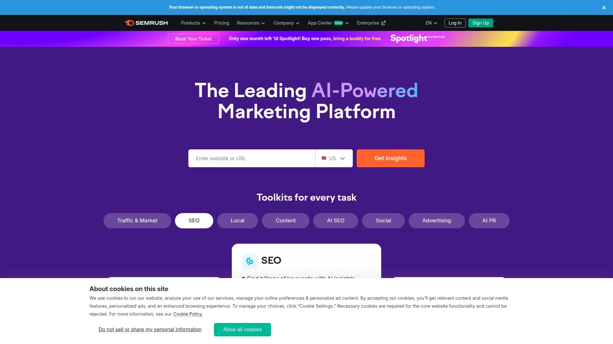

**Core Capabilities:**
Semrush processes 25 billion keywords across 142 geographic databases, making it invaluable for international SEO campaigns. The platform's Position Tracking monitors daily ranking changes for target keywords while the Site Audit tool checks over 140 technical SEO issues. Content marketers benefit from the SEO Writing Assistant that optimizes content in real-time based on top-performing pages.

Competitive intelligence features reveal competitor strategies including their top organic keywords, paid search campaigns, and backlink sources. The Traffic Analytics tool estimates competitor website traffic without requiring access to their analytics.

---

## **[Ahrefs](https://ahrefs.com)**

Industry-leading backlink analysis platform with powerful keyword research and content exploration features.

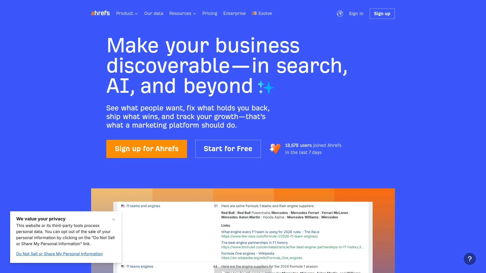

Ahrefs maintains the world's largest third-party database of live backlinks, updating with fresh data every 15 minutes. Their Content Explorer searches through 11 billion web pages to find trending topics and link opportunities in any niche. The Keywords Explorer provides metrics for over 10 billion keywords across 170 countries, including parent topic identification that groups related searches.

Site Explorer reveals any website's organic search traffic, top pages, and referring domains. The Rank Tracker monitors positions across desktop and mobile devices with location-specific accuracy down to city level.

---

## **[Screaming Frog](https://screamingfrog.co.uk)**

Desktop-based website crawler that performs comprehensive technical SEO audits at lightning speed.

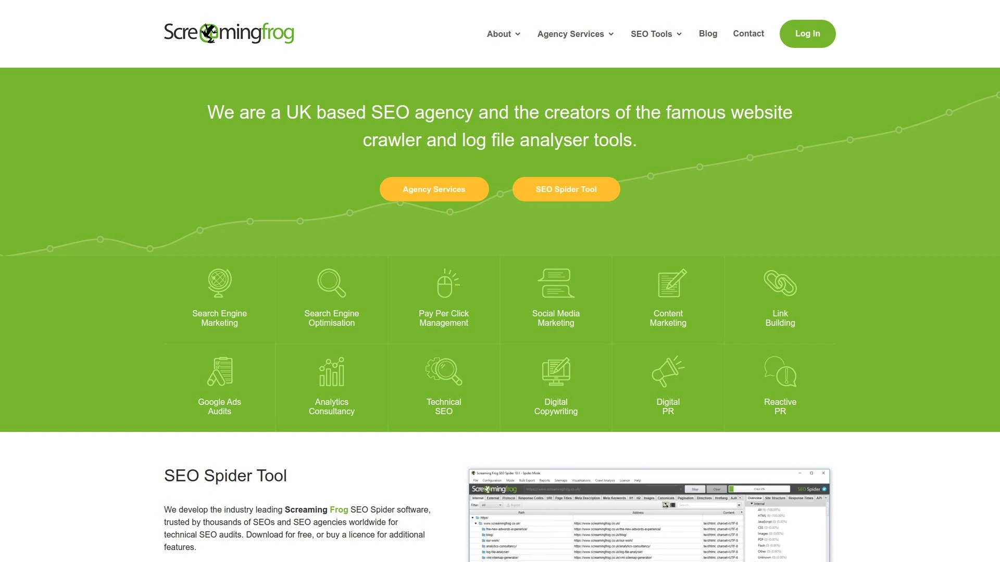

This powerful crawler analyzes up to 500 URLs free, with unlimited crawling available in the paid version. It identifies broken links, duplicate content, missing meta descriptions, oversized images, and hundreds of other technical issues that impact search performance. The software integrates with Google Analytics, Search Console, and PageSpeed Insights to provide enriched data within crawl results.

Custom extraction capabilities using CSS Path, XPath, or regex allow SEO professionals to audit specific website elements at scale. The log file analyzer helps understand how search engines crawl your site, revealing crawl budget waste and orphaned pages.

---

## **[SE Ranking](https://seranking.com)**

Cost-effective SEO platform delivering enterprise features at small business prices.

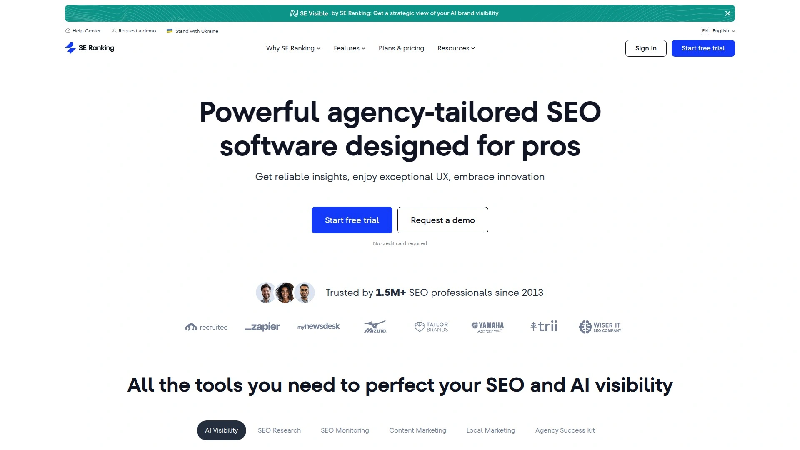

**Value Proposition and Features:**

SE Ranking tracks rankings daily across multiple search engines and locations while maintaining pricing significantly below competitors. The keyword research tool includes a unique keyword grouper that automatically clusters related terms for content planning. Website audit reports score pages on 120+ parameters with clear fix priorities.

The platform includes white-label reporting capabilities, making it popular among agencies. Competitor research reveals keyword gaps and tracks SERP feature appearances. The backlink checker monitors new and lost links with instant email alerts for important changes.

---

## **[Mangools](https://mangools.com)**

User-friendly SEO toolkit perfect for beginners with professional-grade data accuracy.

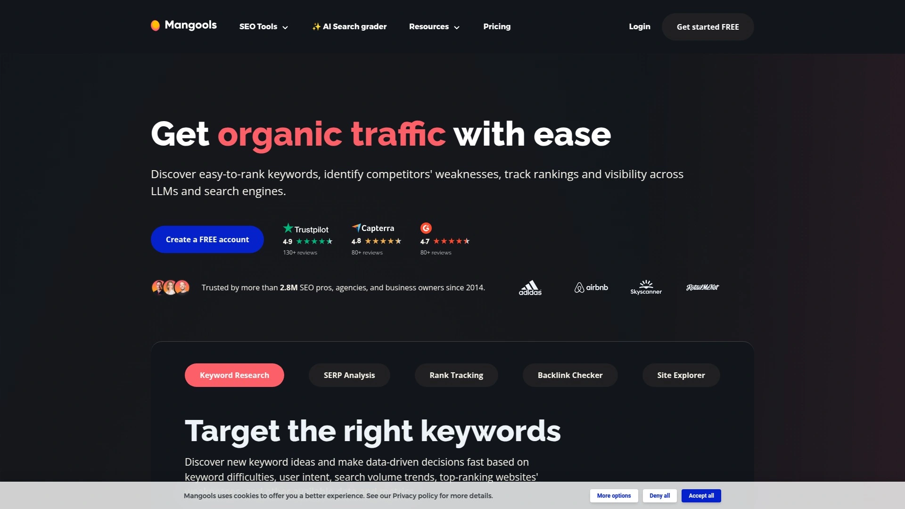

Mangools packages five specialized tools that work seamlessly together: KWFinder for keyword research, SERPChecker for SERP analysis, SERPWatcher for rank tracking, LinkMiner for backlink analysis, and SiteProfiler for website metrics. The interface prioritizes visual data presentation, making complex metrics immediately understandable.

KWFinder excels at finding long-tail keywords with low competition scores based on comprehensive competitor analysis. SERPWatcher's Performance Index simplifies rank tracking into a single metric showing overall visibility trends.

---

## **[SpyFu](https://spyfu.com)**

Competitive intelligence platform specializing in historical SEO and PPC data analysis.

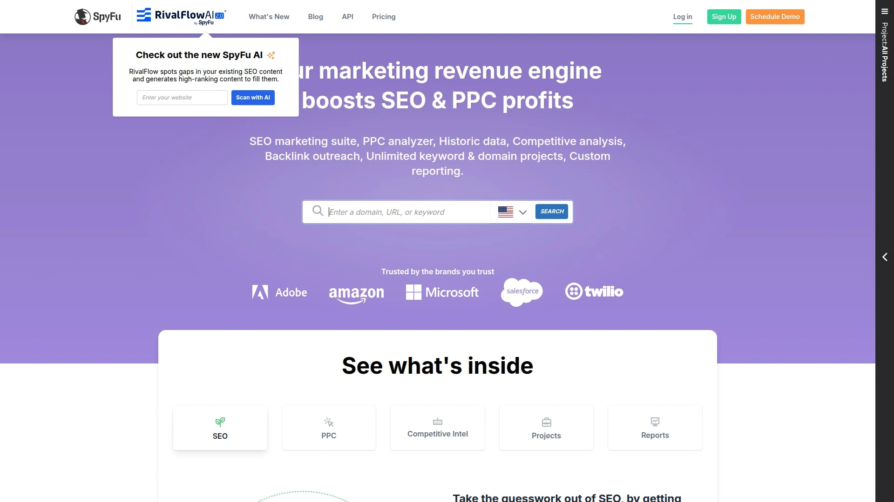

SpyFu's standout feature provides up to 16 years of historical data showing how competitor strategies evolved over time. Users can see every keyword a domain has ranked for, every ad variation tested, and every backlink acquired. The Kombat tool visualizes keyword overlap between multiple competitors, identifying unique opportunities.

PPC research capabilities reveal competitor ad spend estimates, most profitable keywords, and complete ad copy history. The SEO research suite tracks ranking changes and estimates organic click-through rates based on SERP features present.

---

## **[Ubersuggest](https://ubersuggest.com)**

Neil Patel's accessible SEO tool offering comprehensive features with generous free tier access.

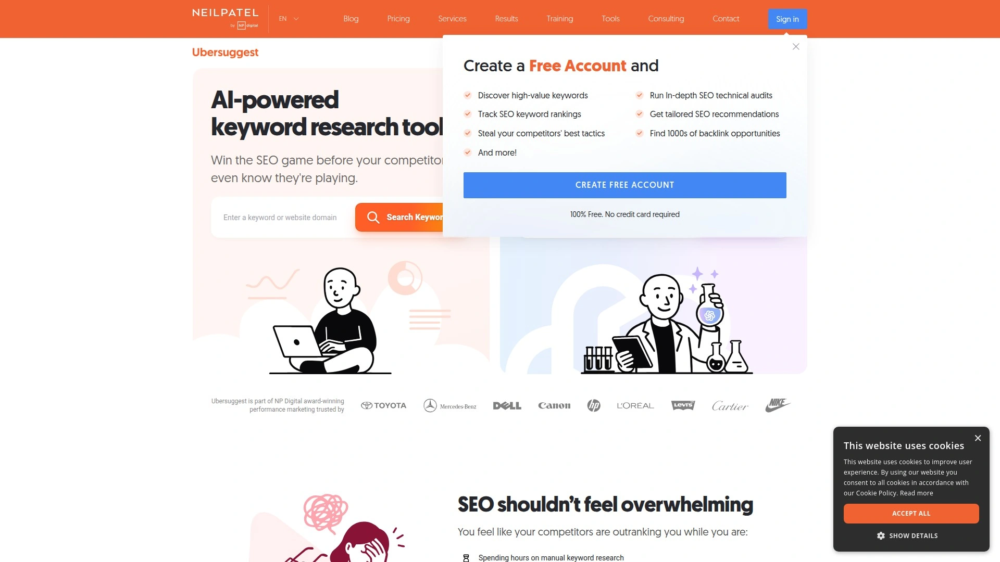

**Accessibility and Functionality:**

Ubersuggest democratizes SEO by providing substantial free daily searches including keyword ideas, domain analysis, and site audits. The keyword tool generates hundreds of suggestions from Google Suggest, related searches, and question-based queries. Content ideas feature analyzes top-performing content for any keyword, showing social shares and estimated traffic.

The Chrome extension displays search volume and CPC data directly in Google search results. Site audit functionality checks for common SEO issues with step-by-step fixing instructions suitable for non-technical users.

---

## **[Majestic](https://majestic.com)**

Specialized link intelligence tool with the largest commercially available backlink database.

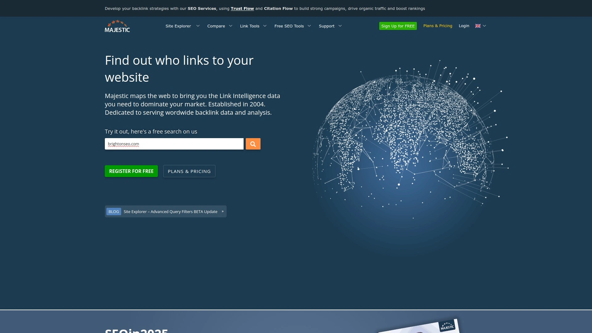

Majestic's Fresh Index updates throughout the day while the Historic Index contains over 15 years of crawl data. Their unique Trust Flow and Citation Flow metrics evaluate link quality and quantity respectively. The Topical Trust Flow categorizes websites into nearly 1,000 topics, helping identify relevant link opportunities.

Bulk backlink checking processes up to one million domains simultaneously. The Campaigns feature tracks link building progress and competitor link acquisition over time. Site Explorer visualizes link profiles through interactive charts showing referring domain distribution and anchor text ratios.

---

## **[Serpstat](https://serpstat.com)**

Growth hacking platform combining SEO, PPC, and content marketing tools with unique clustering algorithms.

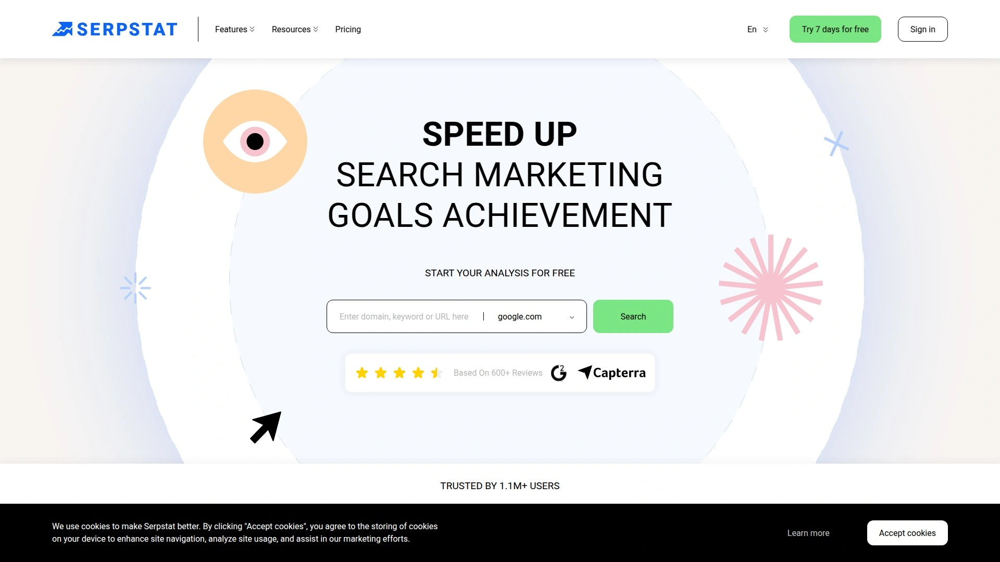

Serpstat's keyword clustering automatically groups thousands of keywords by SERP similarity, streamlining content planning for topic clusters. The Tree View visualizes website structure and page relationships for improved internal linking strategies. Missing keyword analysis identifies terms competitors rank for that you don't.

The platform includes specialized tools for different team members: SEO specialists get technical audits, content marketers receive topic research, and PPC managers access ad analysis features. API access enables custom integrations and bulk data processing.

---

## **[Raven Tools](https://raventools.com)**

Agency-focused SEO platform emphasizing automated reporting and client management features.

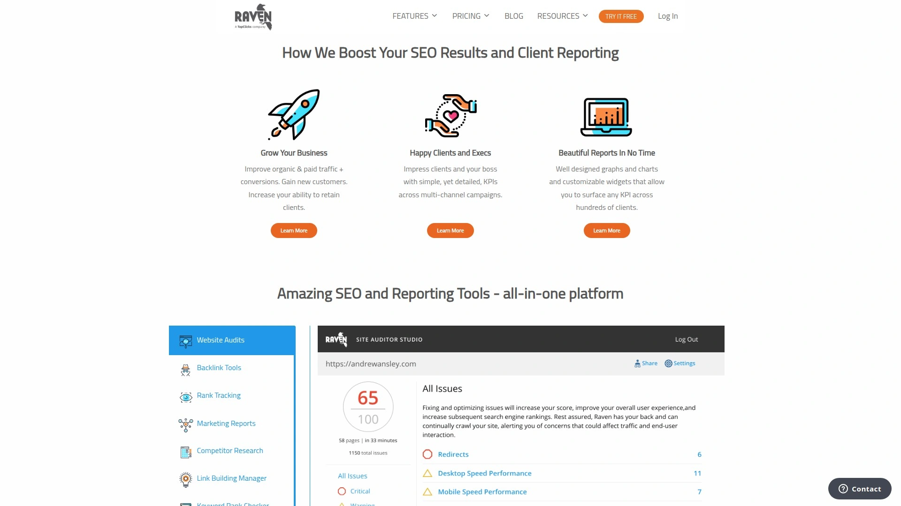

**Agency Optimization Features:**

Raven Tools centralizes data from over 20 marketing platforms into unified dashboards and reports. The drag-and-drop report builder creates branded client reports automatically pulling fresh data. Website auditor checks for 150+ issues with white-labeled reports showing before-and-after improvements.

Keyword rank tracking includes SERP features and local pack positions. The link building CRM manages outreach campaigns with email templates and response tracking. Social media integration monitors brand mentions and tracks engagement metrics alongside SEO performance.

---

## **[CognitiveSEO](https://cognitiveseo.com)**

Advanced SEO analysis platform with strong focus on penalty detection and link quality assessment.

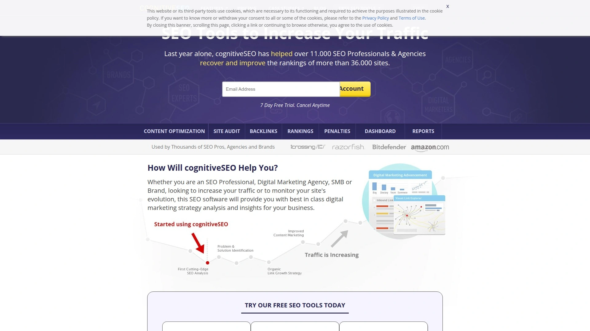

CognitiveSEO's Unnatural Link Detection identifies potentially harmful backlinks using machine learning algorithms trained on Google penalty patterns. The content optimization tool analyzes top-ranking pages to provide specific recommendations for keyword density, content length, and topic coverage.

Site Explorer offers in-depth competitive analysis with side-by-side domain comparisons. The rank tracker includes mobile rankings and visibility scores across universal search results. Instant alerts notify users of significant ranking changes or potential algorithm impacts.

---

## **[BrightEdge](https://brightedge.com)**

Enterprise SEO platform leveraging artificial intelligence for predictive insights and automated optimization.

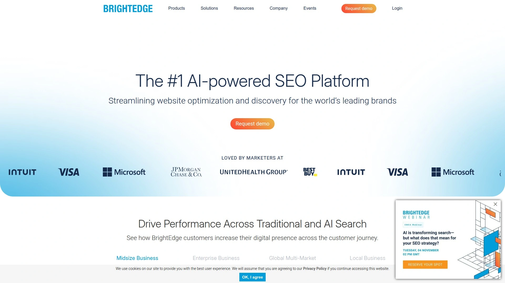

BrightEdge DataCube processes 4.5 billion search queries daily, providing real-time competitive intelligence at massive scale. The platform's AI generates content recommendations based on search intent analysis and competitor gaps. Automated reporting tracks custom KPIs with anomaly detection alerting to unusual changes.

ContentIQ performs continuous site audits identifying technical issues and content opportunities. The platform integrates with major analytics and marketing platforms for unified performance tracking. Share of Voice reporting measures brand visibility against competitors across entire market segments.

---

## **[Conductor](https://conductor.com)**

Enterprise organic marketing platform connecting SEO insights to business outcomes and revenue.

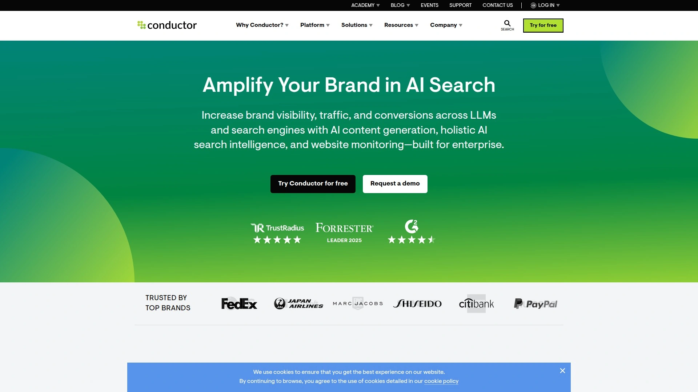

**Enterprise Integration and Intelligence:**

Conductor transforms SEO data into actionable business intelligence by connecting organic performance to conversion metrics and revenue. The platform's Explorer tool uncovers customer intent patterns across the entire purchase journey. Content guidance provides topic modeling and optimization recommendations based on competitive analysis.

Real-time reporting dashboards track performance across teams and global markets. The platform includes workflow management for content creation and optimization projects. API integrations with enterprise systems enable SEO data incorporation into broader business intelligence initiatives.

---

## **[seoClarity](https://seoclarity.net)**

AI-powered enterprise SEO platform processing billions of data points for actionable insights.

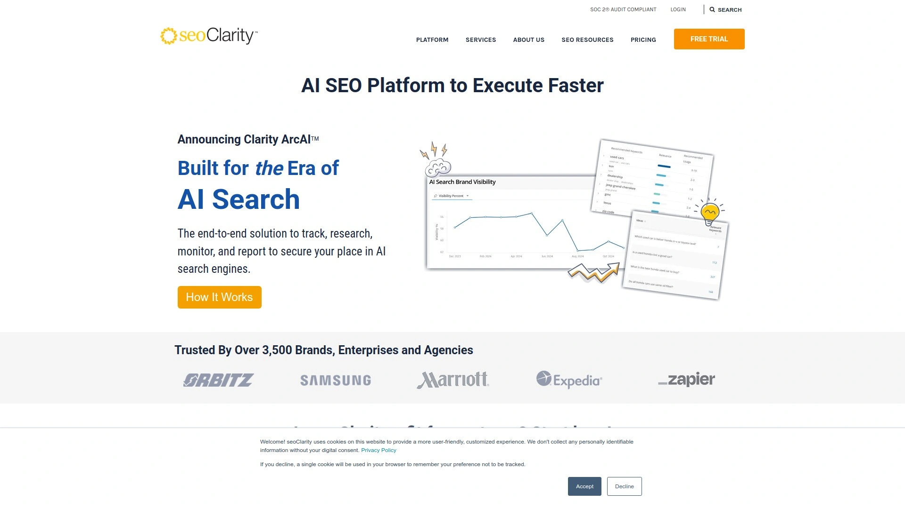

seoClarity's Content Fusion technology uses natural language processing to identify content gaps and optimization opportunities at scale. The platform tracks 100+ billion keywords across all search engines and countries. Site audit capabilities analyze millions of pages identifying technical issues impacting large-scale websites.

The Topic Explorer uses machine learning to map entire topic ecosystems and identify content opportunities. Competitive visibility metrics track market share across industries and geographic regions. Custom dashboards provide role-based views for different stakeholders from executives to technical SEO specialists.

---

## **[Botify](https://botify.com)**

Technical SEO platform specializing in enterprise website crawling and log file analysis.

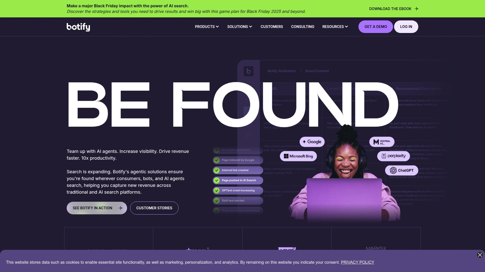

Botify crawls websites with millions of pages, providing insights impossible to obtain through sampling-based tools. The platform combines crawl data with log files and analytics to understand actual search engine behavior. JavaScript rendering capabilities ensure accurate analysis of modern websites.

RealKeywords integrates Search Console data showing actual queries driving traffic to each page. The platform identifies crawl budget waste and helps prioritize pages for search engine discovery. ActionBoard provides automated alerts for critical technical issues requiring immediate attention.

---

## **[DeepCrawl](https://deepcrawl.com)**

Cloud-based website crawler built for technical SEO at enterprise scale.

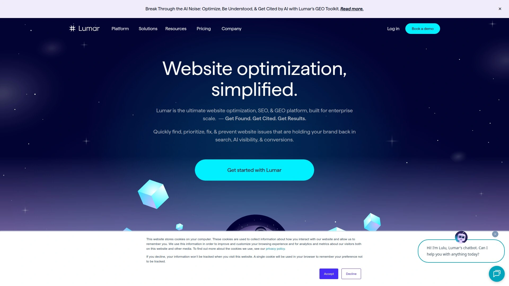

**Technical Excellence:**

DeepCrawl processes websites with millions of URLs, identifying technical issues before they impact organic performance. The platform's automation suite runs regular crawls comparing changes over time to catch new issues immediately. Custom extraction enables monitoring of specific page elements crucial for SEO performance.

Integration with Google Search Console, Analytics, and Adobe Analytics enriches crawl data with performance metrics. The platform tracks Core Web Vitals and page experience signals affecting rankings. API access enables incorporation of crawl data into existing workflows and reporting systems.

---

## **[Sistrix](https://sistrix.com)**

European-focused SEO suite with extensive historical data and visibility index tracking.

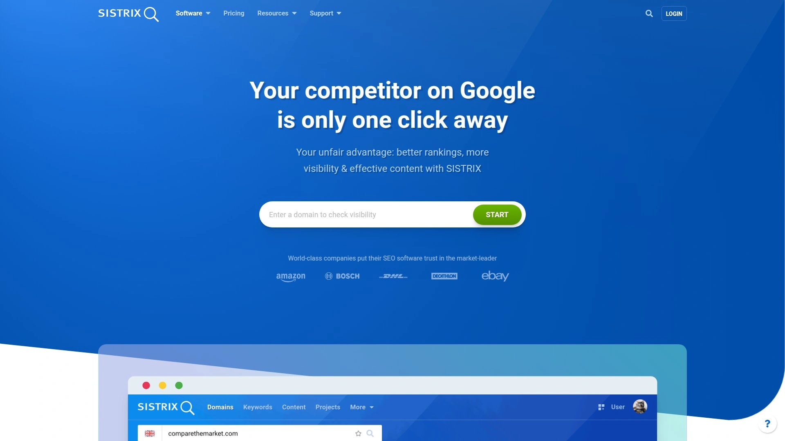

Sistrix Visibility Index has tracked domain performance since 2008, showing long-term SEO trends and algorithm impact. The platform excels in international SEO with detailed data for 40 countries. Mobile versus desktop tracking reveals device-specific optimization opportunities.

The Optimizer module performs comprehensive site audits with priority-based issue resolution. Link module analyzes backlink profiles with Link Rating metric evaluating domain authority. Amazon module tracks product rankings and visibility on the marketplace.

---

## **[Searchmetrics](https://searchmetrics.com)**

Content and SEO platform using deep learning to optimize for search intent and user experience.

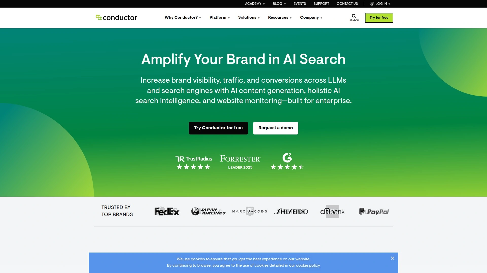

Searchmetrics Content Experience provides AI-powered content briefs based on comprehensive competitor analysis. The platform identifies search intent patterns to guide content creation matching user needs. Topic Explorer maps entire content territories showing coverage gaps and opportunities.

Site Experience audits technical SEO while monitoring Core Web Vitals and page speed metrics. Market Share reporting tracks visibility across entire industries rather than individual keywords. The platform's machine learning models predict traffic potential for content before publication.

---

## **[Advanced Web Ranking](https://advancedwebranking.com)**

Specialized rank tracking platform with white-label reporting and agency management features.

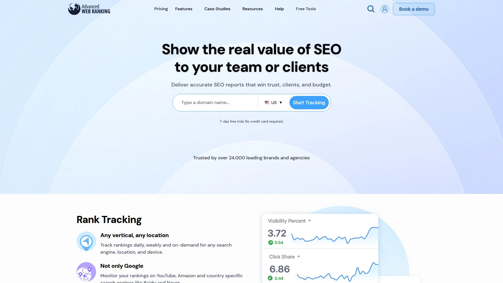

Advanced Web Ranking tracks unlimited keywords across multiple search engines with daily, weekly, or on-demand updates. The platform monitors rankings at country, state, city, or neighborhood level for local SEO campaigns. SERP feature tracking shows when results include featured snippets, knowledge panels, or other elements.

White-label reports include custom branding and automated delivery schedules. The platform integrates with Google Analytics and Search Console for enhanced reporting. API access enables custom integrations and bulk rank checking capabilities. Developer-friendly features include scriptable reports and data export options.

---

# FAQ Common Questions

**Q: Which SEO tools are best for small businesses with limited budgets?**
A: Start with Ubersuggest or Mangools for affordable comprehensive features. Both offer generous free tiers or low-cost plans while providing keyword research, rank tracking, and site audit capabilities essential for growing organic traffic.

**Q: How do I choose between Ahrefs and Semrush for competitive analysis?**
A: Ahrefs excels in backlink analysis with the most frequently updated link database, while Semrush provides broader digital marketing features including PPC and social media insights. Consider Ahrefs for link-focused strategies and Semrush for integrated campaign management.

---

# Conclusion

These 20 SEO platforms represent the most powerful tools available for improving search rankings and organic traffic in 2025. Each offers unique strengths from technical auditing to competitive intelligence and content optimization. [Moz](https://moz.com) particularly excels for businesses seeking a balanced combination of beginner-friendly interfaces with professional-grade data accuracy, making it an ideal starting point for companies serious about long-term SEO success.
